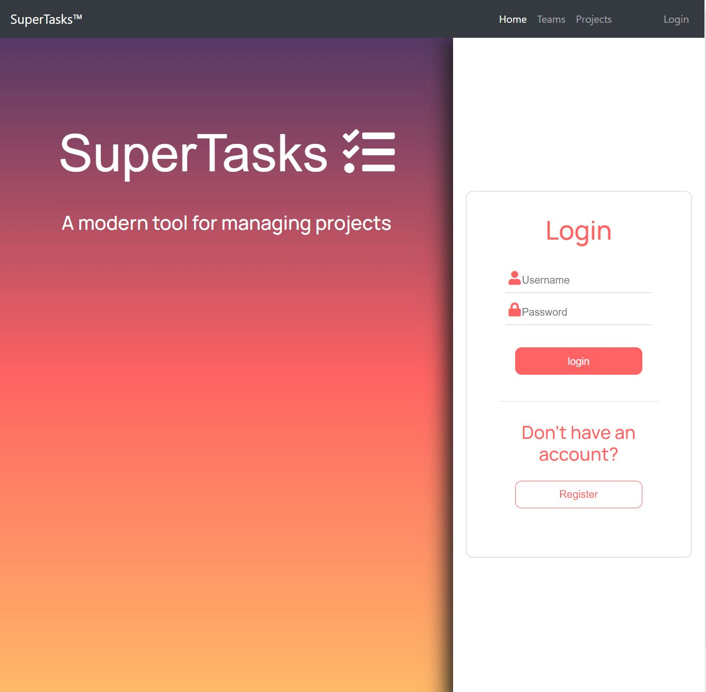
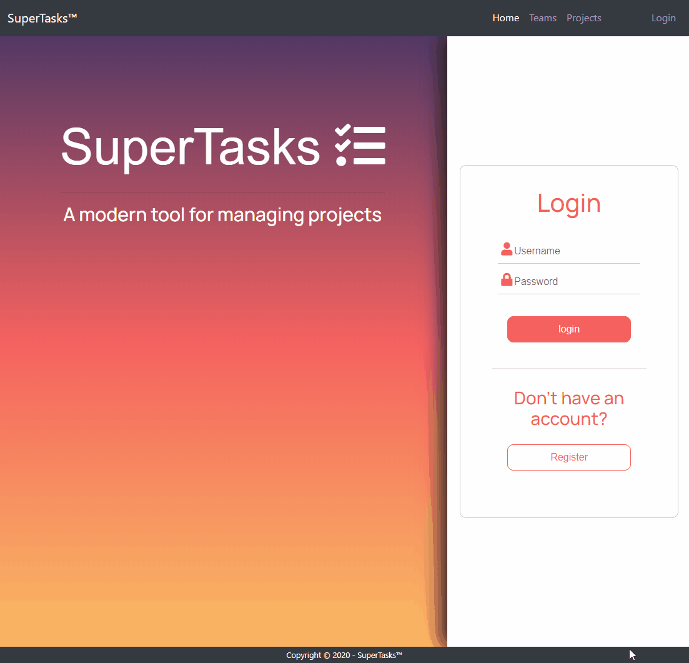
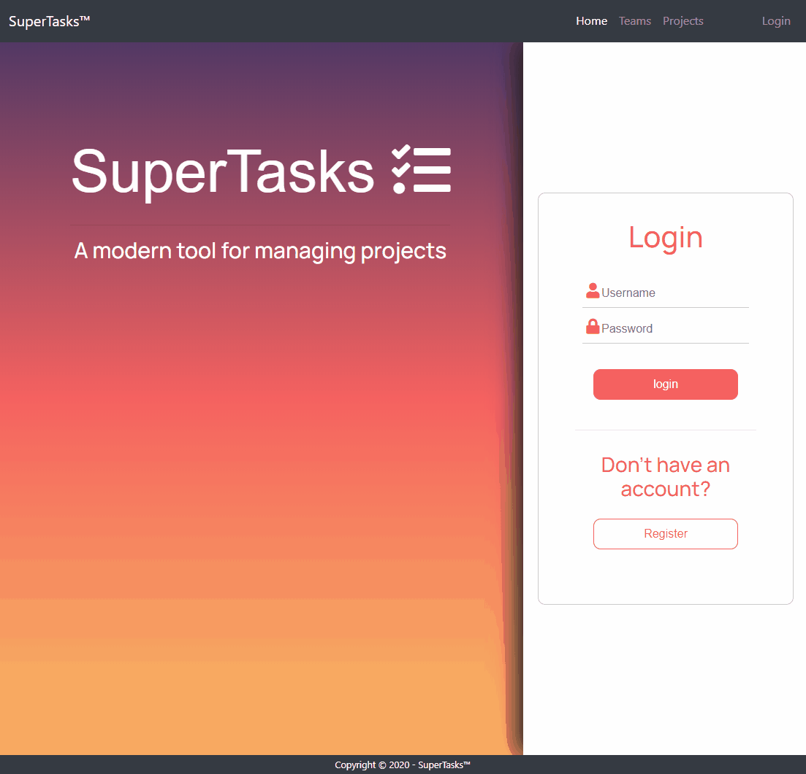
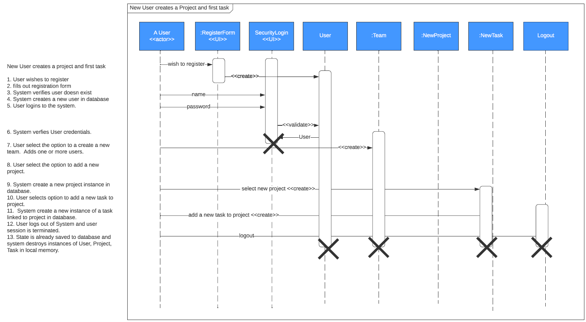
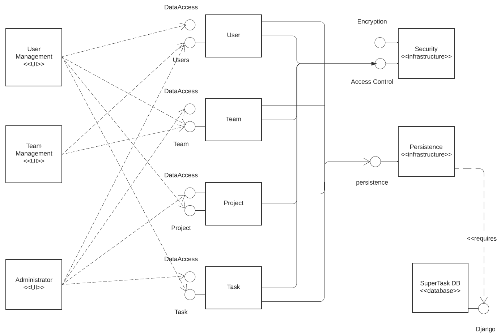
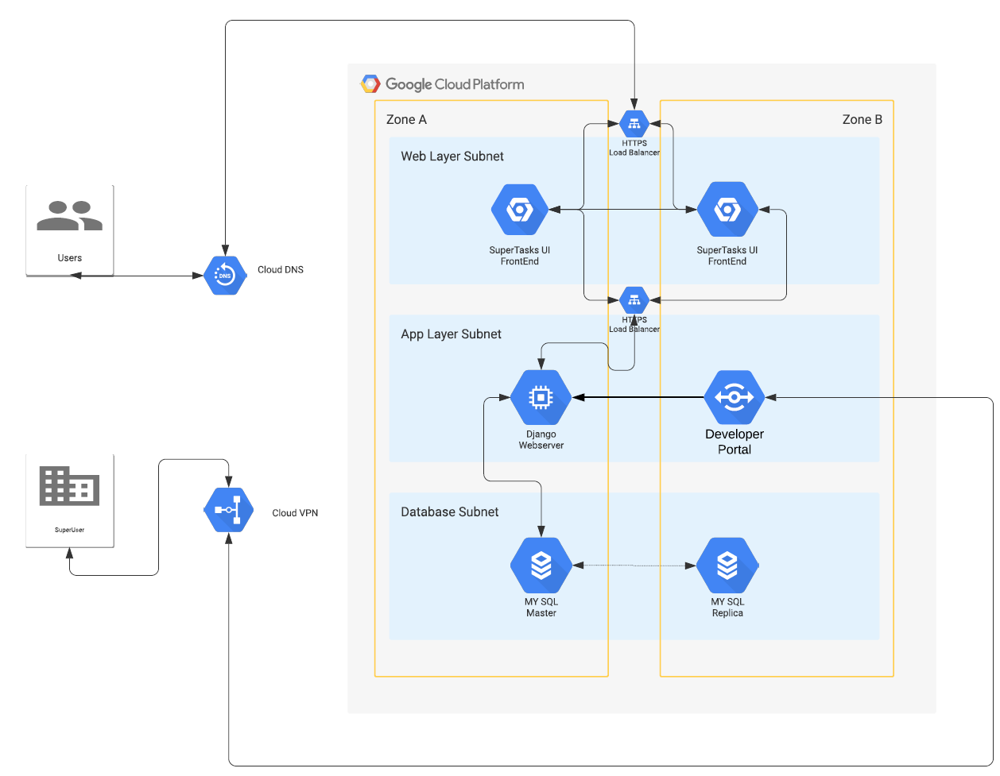

<!--
*** Readme is written using reference style links for readability and maintainability
*** Instead of parentheses () Reference links will be enclosed in brackets []
*** https://www.markdownguide.org/basic-syntax/#reference-style-links
-->

<!-- PROJECT LOGO -->
<br />
<p align="center">
  <a href="https://osu-cs361-supertasks.appspot.com/">
    
  </a>

  <h3 align="center">SuperTasks</h3>

  <p align="center">
    A modern tool for managing projects
    <br />

<!-- TABLE OF CONTENTS -->
## Table of Contents

* [About the Project](#about-the-project)
  * [An overview of what the project is and what it is meant to accomplish](#overview)
  * [Software's Main Features](#Main-Features)
* [How to access and run SuperTasks](#how-to-access-and-run-supertasks)
  * [Prerequisites to run project locally](#prerequisites)
  * [Installation steps to install, build, run, and use the software](#installation)
  * [Usage](#usage)
* [Quality Attributes](#quality-attributes)
* [Software Architecture and Design Overview](#architecture-and-design)
  * [UML Sequence Diagram](#uml-sequence-diagram)
  * [UML Component Diagram](#uml-component-diagram)
  * [Google Cloud Architecture](#google-cloud-architecture)
* [Design Patterns](#design-patterns)
* [Final State of Software](#final-state-of-software)
* [File Structure](#file-structure)
  * [Known Bugs/Issues](#known-bugs-and-issues)
  * [Product Backlog](#product-backlog)
* [Continuing Contributions](#continuing-contributions)


<!-- ABOUT THE PROJECT -->
## About The Project


### Overview

SuperTasks is a feature, A.K.A task, management web application that helps teams organize their work through a visual dashboard. 

Teams and their members will be able to track what needs to be done, when it needs to be done by, and who is to complete the task. This is done through the heirarchy of a team where a team can have projects, a project can have features, and features can have subfeatures. Each of these are also summarized on the user's dashboard for quick view and they can click on one individually for more details on it.

### Main Features
 * Team Management
  * Create teams
  * Add members to your team
  * Add projects to your team
* Project Management
  * Create a project
  * Assign members to the project
  * Status Updates
    * not started, in-progress, stalled, under review, completed
* Feature Management
  * Creating Features
  * Priority Status
    * low, elevated, highest
  * Creating Subfeatures
  * Assinging Features to members
  * Due Dates for seatures
  * Start Dates
  * Status Updates
    * to do, done
 * Dashboard Views
  * Team View
  * Features View
  * Projects view


<!-- GETTING STARTED -->
## How to Access and Run SuperTasks
The web application can be accessed publically at: [SuperTasks](https://osu-cs361-supertasks.appspot.com/)<sup>1</sup>

Follow these steps if you want to get a local copy of this web application up and running.


### Prerequisites

This is an example of how to list things you need to use the software and how to install them.


**Step 1:** Install Python 3: Go to https://www.python.org/downloads/ and download python version 3.6.
  
  
  Verify PIP came installed with Python3:
  ```sh
  pip -V
  ```
  If not, download the get-pip.py file and ensure it is saved as .py:https://bootstrap.pypa.io/get-pip.py
  ```sh
  python pip -m install -upgrade pip
  ```
  Navigate to the folder it was downloaded to in command prompt and run:
  ```sh
  python get-pip.py
  ```
  You can verify the contents of your current directory using:
  ```sh
  dir
  ```
**Step 2:** Once you have PIP correctly installed, you can upgrade it if updates come out with the following command:
  ```sh
  python -m pip install --upgrade pip
  ```
  Now navigate back to the folder you want to install the project to.
  
**Step 3:** Install the virtual environement manager:
  ```sh
  pip install virtualenv
  ```
**Step 4:** Create a virtual environment instance:
  ```sh
  virtualenv venv
  ```
  
**Step 5:** Start the virtual environment:

   Windows:
   ```sh
   venv\scripts\activate
   ```
   MacOS/Linux:
   ```sh
   source venv/bin/activate
   ```
   If you wish to stop the virtual environment:
   ```sh
   deactivate
   ```


### Installation
 
**Step 1:** Clone the repo
```sh
git clone https://github.com/craigkelleher/CS361-Team-10-Project-repository.git
```
(optional) Rename the file to something simpler: 
  Windows: 
  ```sh
  ren CS361-Team-10-Project-repository SuperTasks
  ```
  MacOS/Linux: 
  ```sh
  mv ./CS361-Team-10-Project-repository/ ./SuperTasks
  ```
**Step 2:** Move to the project root directory
```sh
cd SuperTasks
```
or
```sh
cd CS361-Team-10-Project-repository/
```

**Step 3:** Install modules for all dependencies from our requirements.txt file
```sh
python -m pip install -r local-requirements.txt
```

**Step 4:** Setup Development SQlite Database for local machine use
```sh
python manage.py makemigrations
```
```sh
python manage.py migrate
```

**Step 5 (Optional step):** Create  superuser (admin) to view the development database
```sh
python manage.py createsuperuser
```

**Step 6:** Run the application
```sh
python manage.py runserver
```

**Step 7:** Navigate to localhost:8000 in your web browser of choice.

**Step 8 (Optional):** Stop running the application
```sh
Ctrl c
```


<!-- USAGE EXAMPLES -->
## Usage

This section explains briefly how to use the web application. 
### Registration


### General Usage


<!-- QUALITY ATTRIBUTES -->
## Quality Attributes

1. **Reliability** – For our team it is more important that features work predictably and reliably for our customers, so we started with a limited number of core features to make sure they were done right. In our testing of its reliability, our goal was to ensure for example if a user invoked a feature 10 times, that it would succeed 100% of the time.
2. **Testability** – Especially in the early days of this project’s development, we worked to ensure that features were easily testable and also thoroughly tested before being delivered to clients.
3. **Learnability** – We desire to have intuitive features and ease of navigation to increase customer retention. The site should be relatively simple to navigate, easily learned, and visual cues are to be plentiful. 


<!-- ARCHITECTURE -->
## Architecture And Design

### UML Sequence Diagram


### UML Component Diagram


### Google Cloud Architecture



<!-- DESIGN PATTERNS -->
## Design Patterns

**Observer**

The software uses the design pattern of “observer” where a one-to-many dependency between objects is defined in that when one object changes status, all of its subordinate objects are updated with that status. 

For our application, when a project is marked complete by a user, all of its tasks are also marked complete if they haven’t already been done so manually by the group.

<!-- FINAL STATE OF SOFTWARE -->
## Final State of Software
 
### Known Bugs and Issues
* Changing fields of a subtask, can update completion status and the name but not description
* Unable to assinging a user to a feature but can assign users to subtask
* Tasks on main page connects to subtask rather than features. To edit features, we have to go to manage project first and see the features and subtasks to edit them.
* Unable to delete tasks/subtasks/projects after creation, can edit them and change people but not outright delete
*	Unable to remove everyone from a team after adding them, can remove all but one user from a team

### Product Backlog
*	As a user I can assign Planning Points to my features so that I can better allocate my team's capacity to do work
*	As a user I can assign Planning Points to my subtasks so that I can better allocate my team's capacity to do work

<!-- FILE STRUCTURE -->
## File Structure

* **Root Folder**
  * The root folder contains access to all the other folders the application uses
  * Readme file (this file)
  * Migrations readme to describe how to troubleshoot any migrations with google cloud uploads
  * local-requirements file to help with installing dependencies
  * manage.py file used to execute Django tasks to start the web application
  * files to aide in the automatic deployment to cloud when pushed to master.
  * **Static Folder** Contains our static design files for CSS JS and holds images[]()
    * CSS, images, javascript, admin
  * **Templates Folder** Contains the html code to create the homepages
    * base.html, footer.html, index.html, navbar.html
  * **teams Folder** Contains python code files to make the teams module work and two folders
    * templates folder (contains the html code files to create the pages that will cover teams
    * migrations folder
  * **projects Folder** Contains python code files to make the projects module work and two folders
    * templates folder (contains the html code files to create the pages that will cover projects
    * migrations folder
  * **accounts Folder** Contains python code files to make the accounts module work and two folders
    * templates folder (contains the html code files to create the pages that will cover accounts
    * migrations folder
  * **SuperTasks Folder**
    * Base urls.py file to redirect pages where the user wants to go
    * Base views.py file to manage how redirecting works and how pages will be rendered
    * tests to check if user is logged in or not and redirect
    * settings.py file

<!-- CONTINUING CONTRIBUTIONS -->

## Continuing Contributions

   Developed by: 
  `Michael Hathaway`, `Kevin Hill`, `Craig Kelleher`, `David Mikulis`, `Steven Owens`
  
1. How will members of your team and (optionally) new developers can contribute to the project in the future
   * All members of the team can continue contributing to the project as they are now.
   * All contributions are done on branches of master branch and pull requests must be checked/reviewed by another member of the group and go througha testing cycle before being approved by peers to be pushed to master.
2. Who will be the keeper of the project? Multiple people? Nobody?
   * All developers of this project are keepers of it, so currently 5 named contributers
3. How do new people become contributers?
    * New individuals can become contributers with majority support, and they would need to know that to push updates to master, they must have support from another reviewer/team member.
4. What do they need to know?
    * Pushing a branch to master automatically updates the web application to google cloud. Any testing should be done on the local system because of this before pushing to master.


<sup>1 </sup><sub>Project hosting provided by Google Cloud using the Google App Engine.</sub>
<!-- MARKDOWN LINKS & IMAGES -->
<!-- https://www.markdownguide.org/basic-syntax/#reference-style-links -->
[product-screenshot]: static/images/screenshot.jpg
